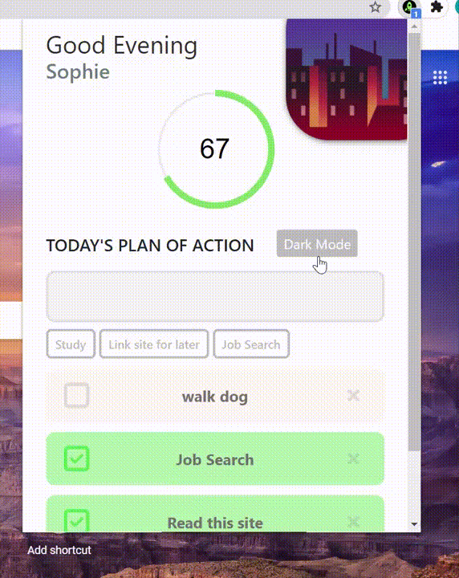

# Chrome Extension

As part of the Profit with Javascript course, I was able to create this Chrome Extenion, that allows users to add their daily tasks, where they can tick them off, delete them and it also includes a dark mode feature.

Here is the [link](https://chrome.google.com/webstore/detail/daily-planner/mokfonabcmhhnohneodilbggkkckipkl) to the extension in the Chrome Web Store. 